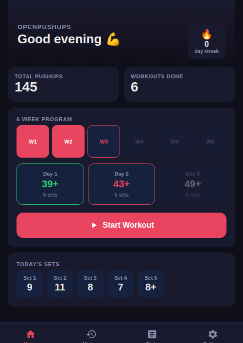
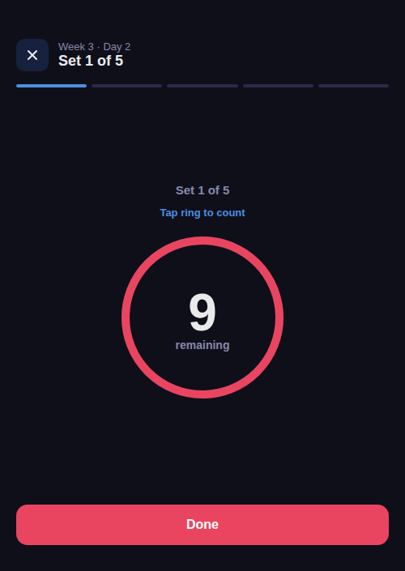
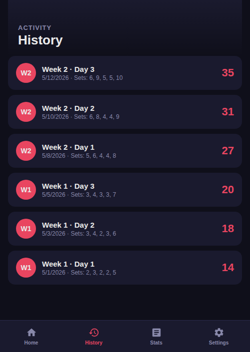
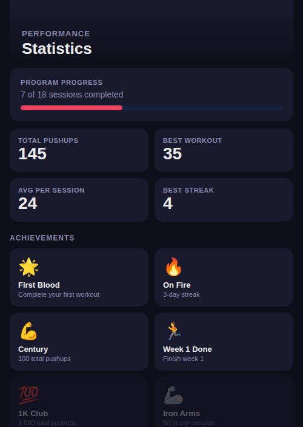
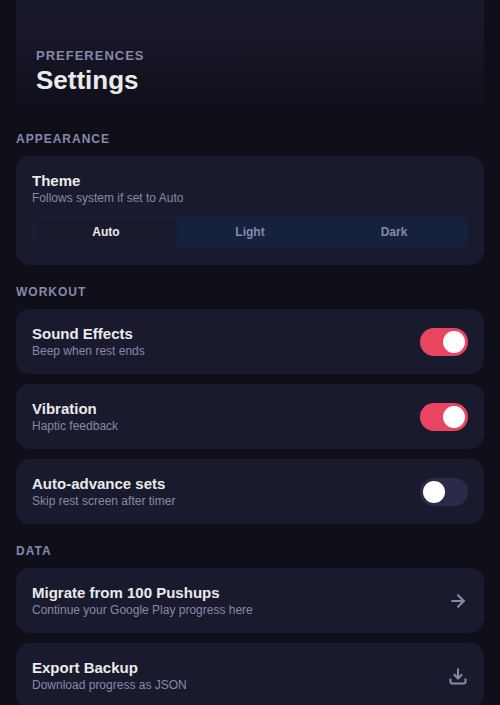

# 💪 OpenPushups

A free, open-source PWA pushup coach modeled on *Push Ups Workout* (`com.northpark.pushups`) — an initial test sets your level, then an adaptive plan across 6 levels takes over. No account; progress is stored by a tiny bundled server so all your devices share one history.

Built as a single HTML file plus a tiny dependency-free Python server. Run it, open it in any browser, add it to your home screen, and go.

## Screenshots

<p align="center">
  
  
  
</p>
<p align="center">
  
  
</p>

## Features

- **Adaptive level program** — an initial max-effort test sets your starting level; 6 levels × 3 groups, and after each workout you rate it (*so hard / just right / so easy*) to move up or repeat
- **Initial test** — one open-ended max set maps you to the right starting level
- **Freestyle mode** — free push-up counting with no plan, logged to your history
- **Tap-to-count ring** — tap the ring with a finger or your nose (phone face-up) to count each rep; auto-advances to rest when done
- **Rest timer** — visual countdown ring between sets; skip or auto-advance
- **Dark / Light / Auto theme** — follows system preference by default
- **Offline** — service worker caches the app after the first load (saving progress requires the server to be reachable)
- **Server storage** — progress lives in one JSON file on your own server (`data/data.json`), shared across devices; existing on-device data is migrated automatically on first load
- **Export / Import** — back up and restore progress as JSON
- **Publish stats to your website** (opt-in) — push an aggregate `stats.json` (streaks, totals, per-day rep counts — no per-session detail) to a GitHub Pages repo after each workout, using a fine-grained token stored only in your browser
- **Migrate from Push Ups Workout (Google Play)** — import your existing progress via:
  - Manual wizard — pick your current level and group
  - Direct `.puud` file import — reads the app's backup file format (ZIP containing SQLite + JSON preferences), parsed entirely in the browser

## Usage

Run the bundled server (Python stdlib only, no dependencies) and open it in a mobile browser:

```bash
docker compose up -d        # serves on port 8081
# or without Docker:
python3 server.py           # serves on port 8000
```

Progress is stored in `data/data.json` next to the app (gitignored). To update a
deployment, `git pull` (or run `update.sh`, e.g. from cron) — updates never touch
the data directory.

## Migrating from the Push Ups Workout app

1. In the old app: **Settings → Backup** — save the `.puud` file to your device
2. In OpenPushups: **Settings → Import .puud Backup** — select the file
3. Your full history and total rep count are imported automatically

Alternatively use the manual wizard (**Settings → Migrate from Push Ups Workout**) to set your current level/group without a backup file.

## Privacy

Everything stays on your own server. No analytics, no third-party requests — the app only talks to the host it was loaded from. The service worker caches the app for offline use immediately after first visit.

## License

MIT
